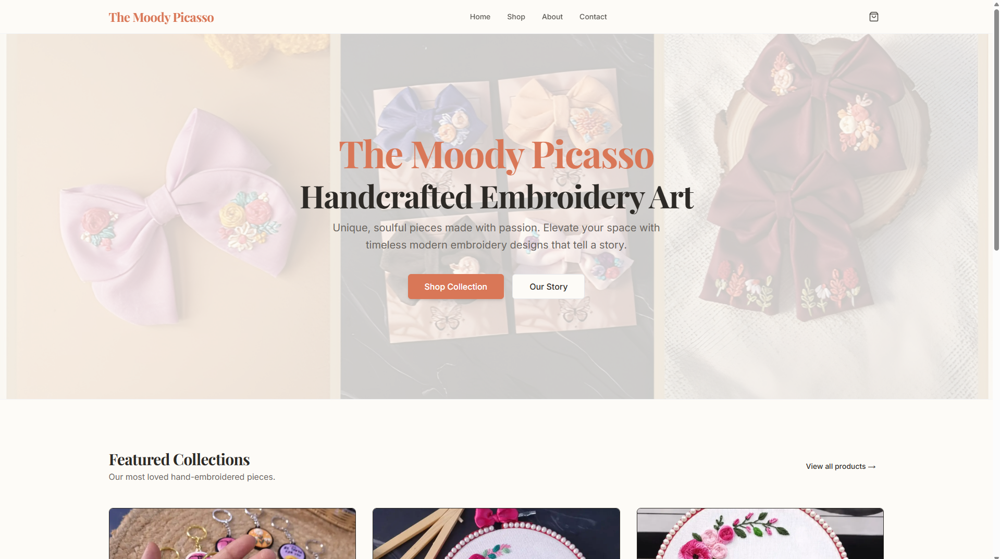
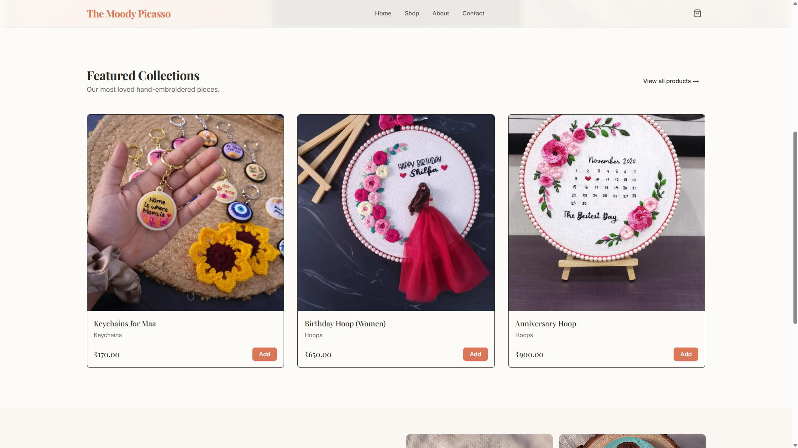
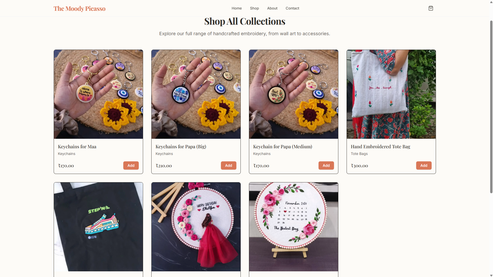
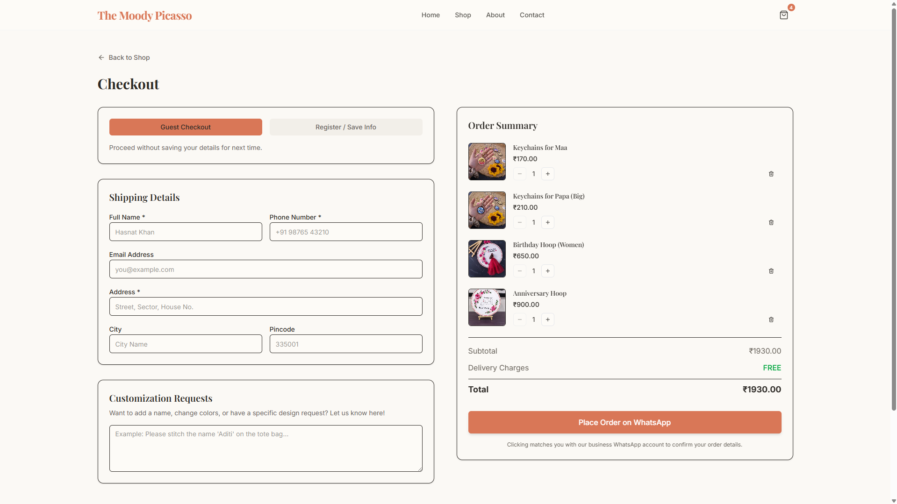

# 🌐 Portfolio Website Development

[](https://nextjs.org/)
[](https://www.typescriptlang.org/)
[](https://vercel.com)
[](LICENSE)

> A modern, responsive portfolio website built with **Next.js 15**, **TypeScript**, and **Tailwind CSS**, showcasing professional projects and technical expertise.

---

## 🚀 [Live Website](https://www.themoodypicasso.com/)

---
## 📊 Previews






---

## ✨ Features

- 🎨 **Modern UI/UX Design** - Clean, professional interface with smooth animations
- 📱 **Fully Responsive** - Optimized for all devices (mobile, tablet, desktop)
- ⚡ **Lightning Fast** - Built with Next.js 15 for optimal performance
- 🎯 **SEO Optimized** - Server-side rendering for better search engine visibility
- 📊 **Product Showcase** - Display products with details
- 🔧 **Type-Safe** - Full TypeScript implementation for code reliability
- 🎭 **Interactive Components** - Engaging user interactions and animations

---

## 🛠️ Tech Stack

### Frontend
- **Framework:** Next.js 15 (App Router)
- **Language:** TypeScript
- **Styling:** Tailwind CSS
- **Font Optimization:** Geist Font Family
- **Linting:** ESLint

### Deployment
- **Platform:** Vercel
- **Domain:** Custom domain or Vercel subdomain

### Development Tools
- **Package Manager:** npm / yarn / pnpm / bun
- **Version Control:** Git & GitHub

---

## 🚦 Getting Started

### Prerequisites

Make sure you have the following installed:
- **Node.js** 18.0 or higher
- **npm** / **yarn** / **pnpm** / **bun**

### Installation

1. **Clone the repository**
   ```bash
   git clone https://github.com/parmesh-kumar-ai/websitedevelopment.git
   cd websitedevelopment
   ```

2. **Install dependencies**
   ```bash
   npm install
   # or
   yarn install
   # or
   pnpm install
   # or
   bun install
   ```

3. **Run the development server**
   ```bash
   npm run dev
   # or
   yarn dev
   # or
   pnpm dev
   # or
   bun dev
   ```

4. **Open your browser**
   
   Navigate to [http://localhost:3000](http://localhost:3000) to see your website in action!

---

## 🔨 Available Scripts

| Command | Description |
|---------|-------------|
| `npm run dev` | Start development server on `localhost:3000` |
| `npm run build` | Build the production-ready application |
| `npm run start` | Start the production server |
| `npm run lint` | Run ESLint to check code quality |

---

## 🚀 Deployment

### Deploy to Vercel (Recommended)

1. **Push your code to GitHub**
   ```bash
   git add .
   git commit -m "Your commit message"
   git push origin main
   ```

2. **Connect to Vercel**
   - Go to [vercel.com](https://vercel.com)
   - Import your GitHub repository
   - Vercel will auto-detect Next.js and configure everything
   - Click "Deploy"

3. **Your site is live!** 🎉

### Alternative Deployment Options
- **Netlify:** Connect your GitHub repo
- **Railway:** Deploy with one click
- **AWS Amplify:** Full-stack deployment
- **Self-hosted:** Build and deploy on your own server

---

## 📚 Learn More

### Next.js Resources
- [Next.js Documentation](https://nextjs.org/docs) - Comprehensive guide
- [Learn Next.js](https://nextjs.org/learn) - Interactive tutorial
- [Next.js GitHub](https://github.com/vercel/next.js) - Source code & community

### TypeScript Resources
- [TypeScript Handbook](https://www.typescriptlang.org/docs/)
- [TypeScript with React](https://react-typescript-cheatsheet.netlify.app/)

### Deployment Resources
- [Vercel Documentation](https://vercel.com/docs)
- [Next.js Deployment Guide](https://nextjs.org/docs/app/building-your-application/deploying)

---

## 📄 License

This project is licensed under the **MIT License** - see the [LICENSE](LICENSE) file for details.

---

## ⭐ Show Your Support

If you found this project helpful or interesting, please consider giving it a ⭐️!

---

</div>
